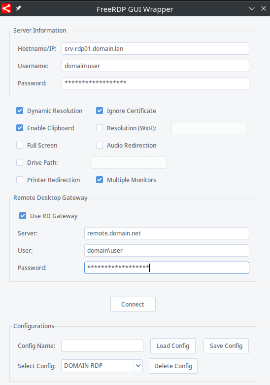

# FreeRDP GUI Wrapper

A simple GUI application for FreeRDP to easily manage and establish RDP connections (Support Remote Desktop Gateway).

TODO: A lot!

## Screenshot

## Features

- Intuitive GUI for setting up and managing remote connections. (Meh...)
- Dynamic resolution adjustment. (Works!)
- Certificate validation options. (Must be always on, for an freerdp issue)
- Clipboard sharing. (Untested)
- Custom resolution settings. (Untested)
- Full screen option. (Works!)
- Audio redirection. (Not work yet :()
- Local drive path redirection. (Untested)
- Printer redirection. (Untested)
- Multi-monitor support. (Works!)
- Integrated support for Remote Desktop Gateway. (Works!)
- Possibility to save config and reload. (Works!)

## Tested on:

- Manjaro Unstable KDE on XOrg

## Dependencies

- `tkinter`
- `ttkthemes`
- `cryptography`
- FreeRDP installed and available in PATH.

## Installation

1. Clone the repository:

`git clone https://github.com/l0rdg3x/FreeRDP-GUI-Wrapper.git`

2. Navigate to the directory and run:

`pip install -r requirements.txt`

3. Run the application with:

`python freerdp_gui.py`

## Usage

Simply launch the application, fill in the server details, choose your desired settings and click on the `Connect` button to establish an RDP session.
Possibility to save config and reload.

## Contributing

Contributions are welcome! Please fork the repository and create a pull request with your changes.

## License

See `LICENSE` for more information.
